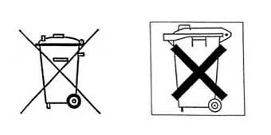
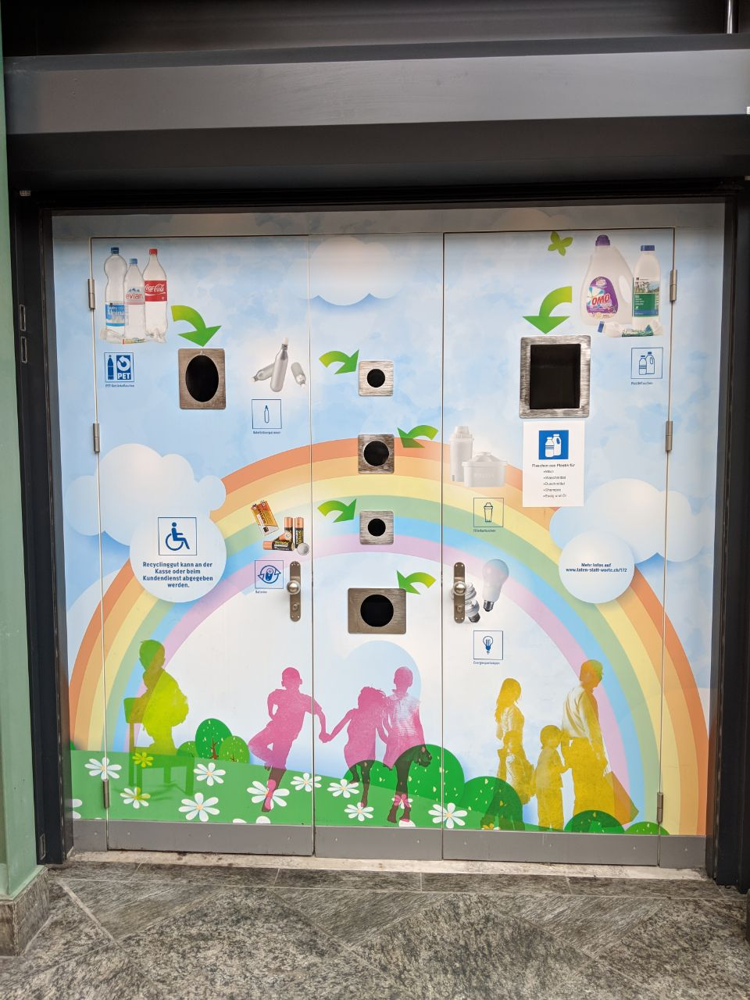
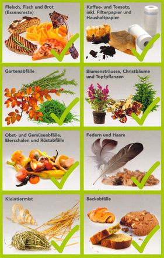

[Оглавление](/faq/) / [Быт](/faq/docs/Быт.html)

# Выбрасывание мусора

## Карта выбрасывания мусора
[recycling-map.ch/en](https://recycling-map.ch/en/)

## Общая информация
Мусор сортируется. Порядок и требования к выбросу и сортировки мусора сильно разнятся от одного города к другому. Общие правила которым следуют все города примерно следующие:
* опасные отходы (батарейки, лампочки) категорически нельзя выбрасывать в общий мусор. Их можно выбросить в специальные емкости которые как правило можно найти недалеко от касс в магазине по характерной иконографике. К опасным отходам относятся все товары маркированные:

    
* ALU (алюминиевая тара) и PET (пластиковая тара) принимается в большинстве магазинов. Стандарта внешнего вида пункта приема тары нет, но выглядит оно как-то так:
    
* Бумага и картон выбрасываются отдельно в специальные дни согласно календарю выбрасывания мусора, который свой для каждого города
* крупногабаритный груз (мебель, елки) вывозится 3-4 раза в год. Во всех городах для этого дни фиксированные. В некоторых, даже выбрасывая в этот день мусор необходимо к мусору прикрепить талон который подтверждает оплату налога на вывоз крупногабаритного мусора. В некоторых городах такие талоны высылают по почте бесплатно, 3-4 штуки в год.

В течении месяца после регистрации по обычной почте должны прийти правила выброса мусора которым необходимо следовать (+ календарь с отмеченными днями когда какой тип мусора забирается).

Ниже информация о выбросе мусора отдельно по городам.

### Zürich
Для выброса елки есть только один день в году. Единственное что гарантируется - он в первых числах января. Онлайн календарь выброса мусора по районам города (или конкретному адресу): [stadt-zuerich.ch/entsorgungskalender](https://www.stadt-zuerich.ch/entsorgungskalender)

### Adliswil
Календарь выброса мусора по Adliswil доступен онлайн: [adliswil-entsorgung.ch](https://adliswil-entsorgung.ch)

Как правило, непосредственно у дома можно найти только два контейнера:
* один для биомусора (компост)
* второй для общего мусора (все что не может быть отсортировано)

В контейнер с биомусором можно выбрасывать только биомусор. Биомусор нельзя выбрасывать в мешке, только вытряхивать.

Что считается компостом:

Для выбрасывания общего мусора необходимо купить специальные мусорные мешки. Такие мешки невозможно найти на прилавках в магазинах, но они обязательно есть у кассира если спросить на кассе. Такие специальные мешки дороже обычных так как включают в себя налог на сортировку. Соответственно чем больше вы не сортируете и выбрасываете в общий мусор - тем больше налога на мусор вы платите. В обычных мешках выбрасывать нельзя, в лучшем случае вы найдете ваши мешки сложенные у контейнера, но как правило приходит сразу большой штраф.

Весь мусор для переработки необходимо относить на специальные сортировочные станции. Обычно их можно найти в пределах каждого района города. Представляет сортировочная станция из себя небольшую площадку размером 20 квадратных метров (или около того) из пола которой торчат трубы с резиновым горлом. Все трубы подписаны по типу мусора который в них можно бросать. Стеклянные бутылки следует носить на такие станции и сортировать по цвету стекла.

Нередко в магазинах так же можно увидеть места для сдачи пластиковых бутылок.

Бумажный мусор следует оставлять рядом с мусорным контейнерам в определенные дни месяца. Календарь с днями когда какой тип мусора можно оставлять рядом с контейнером приходит по почте через некоторое время после прописки по новому адресу.

Елки в Adliswil выбрасываются в контейнер с биомусором. Если елка не помещается в контейнер по размеру, ее необходимо распилить. Согласно правилам, таким образом нельзя выбрасывать елки больше 1,5м в высоту. 

### Bern
Справочник по сортировке мусора в Bern доступен онлайн: [www.bern.ch/themen/abfall/was-entsorge-ich-wie](https://www.bern.ch/themen/abfall/was-entsorge-ich-wie)

# Страховки
Страховка квартиры (от пожара, аварии труб, грабежа) включающая страховку от причинения ущерба третьим лицам по неосторожности (велосипедная авария) в год на семью из троих обойдется примерно в ~400 CHF.

Популярная фирма для страхования [zurich.ch](https://www.zurich.ch/de/privat)

# Покупка продуктов в соседних государствах
В определенных обстоятельствах может помочь немного сэкономить. Но сэкономить получится действительно немного, так как существуют ограничения на ввоз и не нарушить их при оптовых закупках (чтобы поиметь выгоду с разницы в ценах) достаточно сложно. Перед поездкой следует внимательно изучить:
* [действующие ограничения на ввоз](https://www.ezv.admin.ch/ezv/en/home/information-individuals/travel-and-purchases--allowances-and-duty-free-limit/importation-into-switzerland/duty-free-allowances--foodstuffs--alcohol-and-tobacco.html)
* [установить мобильное приложение местной таможни](https://play.google.com/store/apps/details?id=ch.fugu.ZollApp)