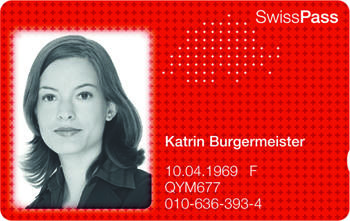

[Оглавление](/README.md) / [Транспорт](/docs/Транспорт.md)

## Проездные
----
### Общая информация
* **ZVV** - локальная транспортная компания, заведует транспортом в Zürich и окраинах: [zvv.ch](www.zvv.ch)
* **SBB/CFF/FFS** - общешвейцарское объединение транспортных компаний. Три аббревиатуры это название одного и того же на трех разных официальных языках. Если коротко то простот SBB: [sbb.ch](https://www.sbb.ch)

Для покупки любого проездного билета необходима карта Swiss Pass:

Покупка проездного при этом оборачивается "привязкой" проездного к уже имеющимся SwissPass. Контролеры при проверке просят показать SwissPass и проверяют "привязан" ли к нему билет разрешающий проезд по текущей транспортной зоне.

Исключение: билеты на разовые поездки которые можно купить в автомате почти на всех остановках.

Для оформления SwissPass необходимо посетить офис SBB. Самый доступный офис в Zürich находится на главном железнодорожном вокзале. С собой необходимо для оформления иметь паспорт и фото паспортного формата 3x4.

Такая система проездных делает невозможным передачу действующего проездного от одного лица другому за счет наличия фотографии на карте SwissPass.

### Где проездные можно купить
* Отделения на вокзалах
* В офисах SBB

### Где одноразовые билеты можно купить
* Автоматы на остановках
* [SBB приложение на iPhone](https://itunes.apple.com/de/app/sbb-mobile/id294855237?l=en&mt=8)

### Типы проездных

#### Halbtax
Для оформления необходима карта Swiss Pass
Это специальный абонемент действительный один год и позволяющий покупать обычные билеты со скидкой 50% (или меньше: 50% гарантированно для железнодорожных билетов). **Важно**: данный абонемент не дает права проезда, на каждую поездку необходимо покупать билет все равно, но с этим абонементом получается значительно дешевле. Для оформления местная прописка (регистрация) не нужна, нужен только адрес на который можно выслать проездной. Приходит по почте через 2-7 дней. При регистрации на вокзале есть возможность сразу на руки получить временную карту и пользоваться ей пока настоящая по почте не придет.

#### GA
Для оформления необходима карта Swiss Pass
«проездной» по всей стране (кроме подъёмников, горных железных дорог и некоторых других отдельных видов транспорта). ~3800 CHF в год. Для оформление необходима местная прописка (регистрация).

#### Локальный проездной
Для покупки необходима карта Swiss Pass
Покупается в автомате или через сайт компании перевозчика которая действует в данном регионе. Для Zürich это [zvv.ch](www.zvv.ch)

### Исходя из опыта
На работу локальный проездной от **ZVV**, а для междугородных поездок и других городов — **Halbtax**. **GA** имеет смысл если ездить 3 раза в месяц по сложным произвольным маршрутам за пределы зоны покрываемые локальными перевозчиками (**zvv** для Zürich).

