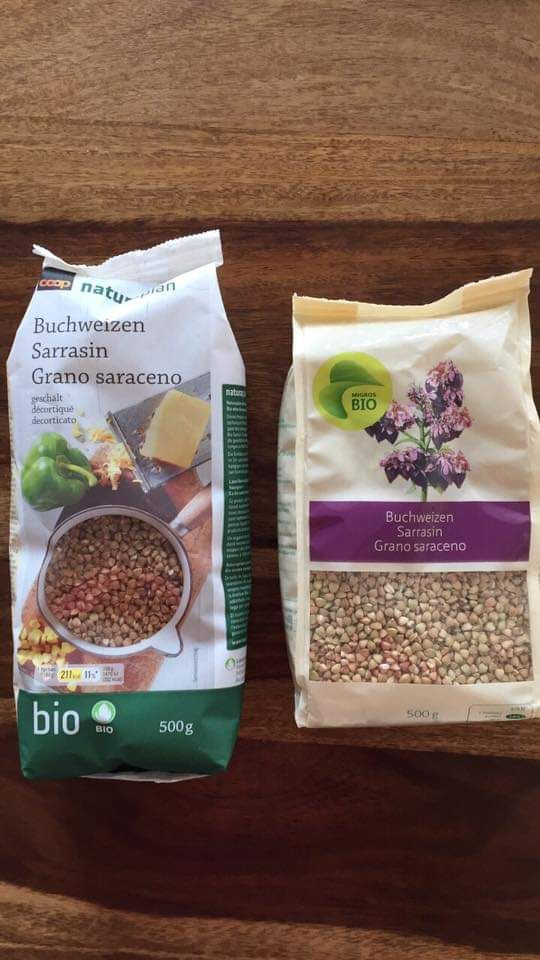

[Оглавление](/faq/) / [Разное](/faq/inbox/Разное.html)

# Календарь праздников (доп выходных)
https://en.wikipedia.org/wiki/Public_holidays_in_Switzerland

# Еда
## Цюрих
Есть магазины восточноевропейской еды:
* Lakomka в Zürich Oerlikon/Schwamendingen, остановка автобуса-трамвая Waldgarten
  * https://www.facebook.com/LakomkaZuerich/
  * https://g.page/LakomkaZuerich?share

* DWA в Adliswil
  * https://www.facebook.com/Dwabiostore/
  * https://goo.gl/maps/zRFFm4UwWVkrXkDAA

##  Лозанна
Грузинский ресторан (Le Pré-Fleuri
)[https://www.tripadvisor.com/Restaurant_Review-g188107-d7820347-Reviews-Le_Pre_Fleuri-Lausanne_Canton_of_Vaud.html].

## Кефир
Можно встретить в магазинах Migros: https://www.google.com/maps/search/zurich,+migro+shop/@47.3781016,8.4830548,13z/data=!3m1!4b1

## Гречка
Можно найти в магазинах Coop и Migros

# Переходники
* Дорогой (зато можно сразу несколько вставить в розетку): https://www.kickstarter.com/projects/1329250080/3-dapter-untangle-your-life-spacesaving-and-aesthe
* Дешевый: https://produkte.migros.ch/do-it-garden-reise-adapter-eu-ch
* Можно поменять вилку целиком: https://produkte.migros.ch/do-it-garden-universal-winkelstecker