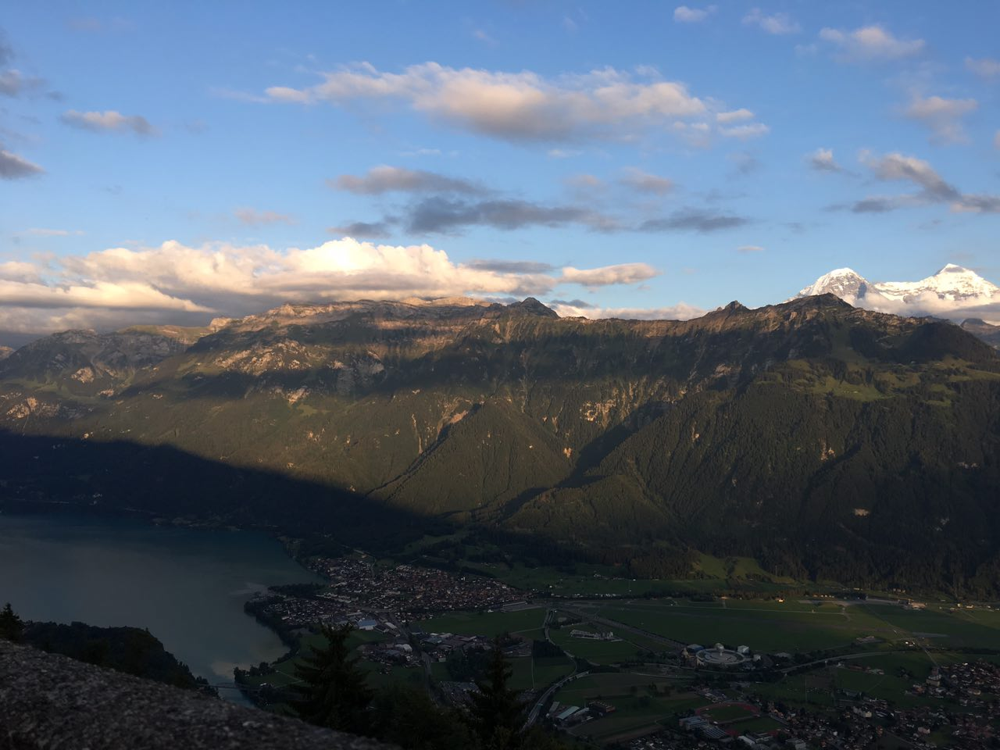
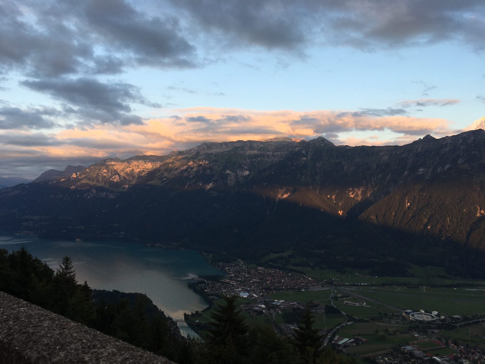
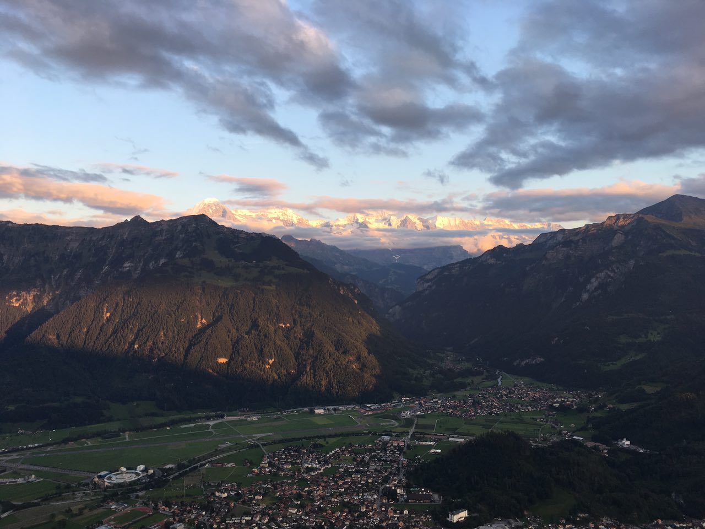
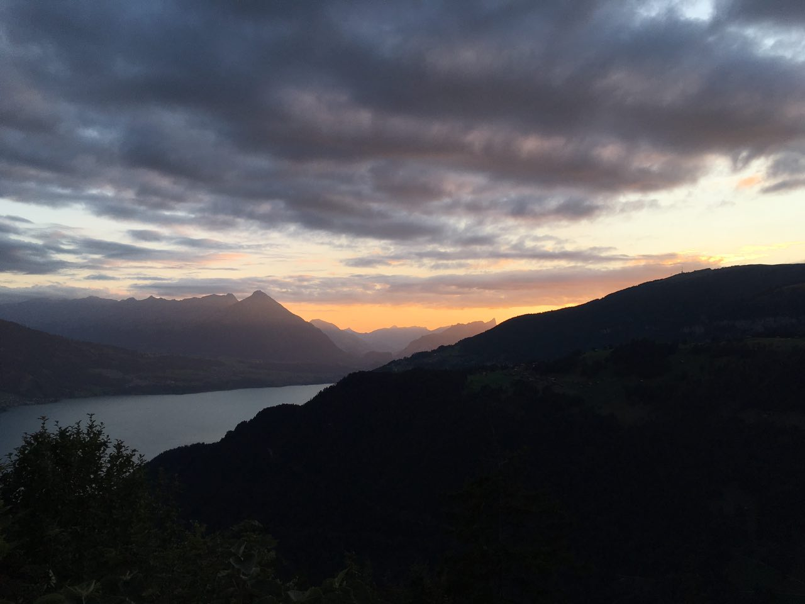

[Оглавление](/faq/) / [Туризм](/faq/inbox/Туризм.html)

# Интерлакен
> в Интерлакене из повыше ... там очень доступный Harder Kulm с хорошим видом

> Интерлакен забит туристами, смотреть там особо не надо что

> А от туда к Augstmatthorn, это одна из самых впечатляющих Wanderung в этом регионе Gratwanderung

> А вот в самом городе, мне кажется, делать нечего

> Тоже так считаю, но там в округе много интересных мест, Beatenberg, или на другой стороне Grindelwald и Lauterbrunnen

> А около Интерлакена на пути к Туну — монастырь в пещерах

> Нету там монастыря, Есть пещера да, до 500м вглубь уходит ... Монастырь был когда-то давно.. существует легенда  о святом Беатусе и драконе , оттуда и название Beatushöhlen,

# Stein am Rein
> В Stein am Rein очень красиво. Правда, не очень удобный подъезд - с пересадкой, потом через Rein переходить.

# Lucern
> Кстати, тоже очень рекомендую Verkehrshaus, классный музей

> Добрались на поезде в Люцерн. Погуляли. С Люцерна доплыли но кораблике до Stansstad, дальше на поезде до Stans, там пешком пришли к фуникулеру на Stanserhorn. Вообще приезжал по рельсам деревянный трамвайчик, а не новомодный фуникулёр (где можно стоять на крыше), который изображён у них на всех картинках.
В любом случае, нас по этому билету не пустили, предложили только скидку 50%. То есть за 72 франка на двоих подняться и спуститься. 
Мы решили съездить на Риги, бесплатно подняться. Из Stans до Beckenried  на автобусе по живописным городкам, оттуда до Vitznau на шикарной 3 палубной яхте, даже по-другому называть не хочется. Там нас пустили на трамвай до вершины без проблем. Прогулялись час и обратно поехали по другому маршруту - на синем трамвае, он спускается 50 минут на другую сторону - в город Goldau. Виды не такие шикарные, так что я бы рекомендовала с вершины спуститься пару остановок пешком по маршруту первого красного трамвая, посмотреть на коров и послушать звон их колокольчиков. дальше сесть на трамвай и вернуться обратно в Vitznau, дальше на кораблике в Люцерн.

> дополнительно ничего не оплачивали

# Spiez
> на поезде наверное мин 15 езды, там с вокзала выходишь и такой вид открывается 😍 Городочек расположен в бухте, которая считается самой красивой в Европе (ну это они там её так рекламируют). Внизу находится  небольшой замок, вокруг виноградники,сад роз итд. 
При хорошей погоде такая красотища 💕